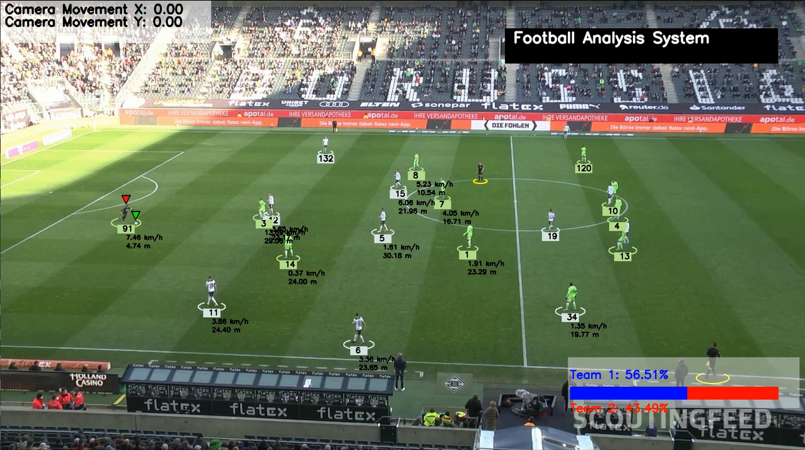

# Football Analysis Project

## Introduction
This project is inspired by **[Football Analysis by Abdullah Tarek](https://github.com/abdullahtarek/football_analysis)**. The original work provided a foundation for tracking players and analyzing ball possession. This version builds upon that by adding additional features such as smoother UI animations, CSV data export, and improved tracking precision.

The goal of this project is to detect and track players, referees, and footballs in a video using YOLO, one of the best AI object detection models available. We will also train the model to improve its performance. Additionally, we will assign players to teams based on the colors of their t-shirts using Kmeans for pixel segmentation and clustering. With this information, we can measure a team's ball acquisition percentage in a match. 

We will also use optical flow to measure camera movement between frames, enabling us to accurately measure a player's movement. Furthermore, we will implement perspective transformation to represent the scene's depth and perspective, allowing us to measure a player's movement in meters rather than pixels. Finally, we will calculate a player's speed and the distance covered.

✔ **New Features Added:**  
✔ **Possession bar is now perfectly aligned with the rectangle.**  
✔ **Smooth transition animation when updating the percentage.**  
✔ **Ability to export data to CSV.**  



---

## Modules Used
The following modules are used in this project:
- **YOLO**: AI object detection model
- **Kmeans**: Pixel segmentation and clustering to detect t-shirt color
- **Optical Flow**: Measure camera movement
- **Perspective Transformation**: Represent scene depth and perspective
- **Speed and distance calculation per player**
- **CSV Export**: Extract match data to a CSV file

---

## Trained Model
- 🔗 **[Download Trained YOLO Model](https://drive.google.com/file/d/1J9usYGfFQwb1hLQktWnP2FKANcJdWPYh/view?usp=drive_link)**

---

## Sample Video
- 🎥 **[Watch Sample Input Video](https://drive.google.com/file/d/1CPONOZ0mvdKpi0mZI_EUn1jx_wO5AyJT/view?usp=drive_link)**

---

## Requirements
To run this project, you need to have the following requirements installed:

* Python 3.x
* ultralytics
* supervision
* OpenCV
* NumPy
* Matplotlib
* Pandas


## Acknowledgments
Special thanks to **[Abdullah Tarek](https://github.com/abdullahtarek/football_analysis)** for his original work on football analysis, which served as an inspiration for this project.


```bash
pip install ultralytics supervision opencv-python numpy matplotlib pandas
